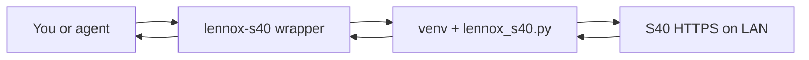
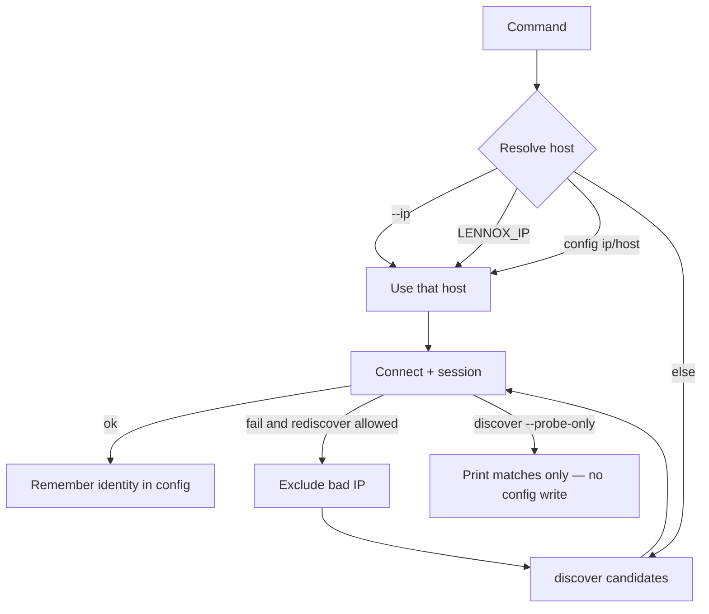

# lennox-s40

> Local LAN control for a Lennox **S40** smart thermostat (also S30/E30 local API) — no Lennox cloud, no baked-in home IP.

A portable, script-backed skill and CLI so you (or an agent) can answer *“what’s downstairs?”* and *“set cool to 76”* from the shell, with a machine-readable contract, multi-host install, and hermetic tests.

**Current release:** [v0.2.1](CHANGELOG.md) · Agent contract: [`skills/lennox-s40/SKILL.md`](skills/lennox-s40/SKILL.md)

---

## The story

### The problem

Home HVAC is often locked behind a vendor app or a cloud account. On a multi-zone Lennox S40 you still want simple answers and setpoints:

- What’s the temperature downstairs?
- Cool that zone to 76 °F.
- Hold the schedule while guests are here.

You want that from a terminal, a cron job, or an AI coding agent — on your LAN, without shipping credentials to Lennox’s cloud.

### The constraint

The S40’s local API is a reverse-engineered HTTPS surface: self-signed TLS (`CN=Lennox`), multi-zone, **no homeowner password** on the wire. Discovery must not blindly trust the first open port; sticky identity (IP + client `app_id`) matters; multi-zone writes need an explicit zone. Anyone who can reach TCP/443 on a trusted LAN and speak the protocol can attempt control — that is the design of the device, not a bug in this skill.

### The approach

**lennox-s40** wraps the community client [lennoxs30api](https://github.com/PeteRager/lennoxs30api) in a small, installable skill:

1. One-time `--setup` (venv + deps).
2. One-time `discover` that **persists only after a verified session** (identity proven).
3. Everyday commands resolve host from flag → env → config → discover, and **rediscover** when a saved IP dies.
4. Exit codes `0`–`5`, redacted status by default, fail-closed config, dep-free paths for version/config/help.

Same package installs as a skill leaf for Claude, Grok, Codex, and Hermes — or as a Claude Code marketplace plugin pinned to a release tag.

### The payoff

Humans and agents share one CLI contract. Install once, discover once, then read and write HVAC without re-passing an IP. CI stays hermetic (no live thermostat required for unit tests). Pin **v0.2.1** when you want a hardened release instead of floating `main`.

### Honesty

This is **unauthenticated local control** of heating and cooling. Prefer a trusted home LAN, DHCP-reserve the thermostat, and read [SECURITY.md](SECURITY.md). Do not expose the S40 to the internet.

---

## How it fits together

### Control path

You or an agent invoke the wrapper; the wrapper selects a venv and runs the Python CLI; the CLI talks HTTPS to the thermostat on the LAN and returns JSON / exit codes.



### Resolve, session, remember, rediscover

Commands do not invent a permanent host from a bare Connect probe alone. A full session proves identity before config is updated. If the remembered IP fails, rediscovery excludes the bad address and retries (unless you pass `--no-rediscover`).



---

## Quick start

From a clone of this repo on a machine that shares the thermostat’s LAN:

```sh
cd ~/src/lennox-s40
./install.sh                                          # Claude + Grok + Codex + Hermes skill leaves
bash skills/lennox-s40/scripts/lennox-s40 --setup      # venv + lennoxs30api
bash skills/lennox-s40/scripts/lennox-s40 discover     # session-verified save → config
bash skills/lennox-s40/scripts/lennox-s40 status       # system + zones JSON
```

Running config (mode `0600`): `~/.config/lennox-s40/config.json`  
(or `$LENNOX_CONFIG` / `$XDG_CONFIG_HOME/lennox-s40/config.json`).

After install, prefer the **installed path** (works from any cwd):

```sh
~/.claude/skills/lennox-s40/scripts/lennox-s40 status
```

(Grok / Codex / Hermes leaves are under the same skill name on their host skill roots — see [references/host-matrix.md](skills/lennox-s40/references/host-matrix.md).)

---

## Use cases (copy-paste)

Examples below use the repo path. Substitute the installed wrapper path after `./install.sh`. Zone names are illustrative (`Downstairs` / `Upstairs`). Doc IPs use the documentation range `192.0.2.0/24`.

### First-time setup

```sh
./install.sh
bash skills/lennox-s40/scripts/lennox-s40 --setup
bash skills/lennox-s40/scripts/lennox-s40 discover
bash skills/lennox-s40/scripts/lennox-s40 status
```

### “What’s the temperature downstairs?”

```sh
bash skills/lennox-s40/scripts/lennox-s40 status
# Read the Downstairs zone object in the JSON (temps in °F).
# For SSID / serial / wifi IP in the payload:
bash skills/lennox-s40/scripts/lennox-s40 --full status
```

### Cool a zone

```sh
bash skills/lennox-s40/scripts/lennox-s40 cool 76 --zone Downstairs
# or set system mode first:
bash skills/lennox-s40/scripts/lennox-s40 mode cool --zone Downstairs
```

### Heat, fan, and away

```sh
bash skills/lennox-s40/scripts/lennox-s40 heat 68 --zone Upstairs
bash skills/lennox-s40/scripts/lennox-s40 fan circulate --zone Downstairs
bash skills/lennox-s40/scripts/lennox-s40 away on
bash skills/lennox-s40/scripts/lennox-s40 away off
```

### Schedule hold

```sh
bash skills/lennox-s40/scripts/lennox-s40 hold on --zone Downstairs
bash skills/lennox-s40/scripts/lennox-s40 hold status --zone Downstairs
bash skills/lennox-s40/scripts/lennox-s40 hold off --zone Downstairs
```

### Probe without writing config

Scan / print matching hosts without creating or updating config (including no generated `app_id` write):

```sh
bash skills/lennox-s40/scripts/lennox-s40 discover --probe-only
```

### Opt-in LAN /24 Connect sweep

Global flags go **before** the subcommand:

```sh
bash skills/lennox-s40/scripts/lennox-s40 --lan-scan discover
# suppressed when LENNOX_NO_LAN_SCAN=1
```

### Force an IP, app-id, or disable rediscover

```sh
bash skills/lennox-s40/scripts/lennox-s40 --ip 192.0.2.10 status
bash skills/lennox-s40/scripts/lennox-s40 --app-id mapp0000000000000000000000000001 status
bash skills/lennox-s40/scripts/lennox-s40 --ip 192.0.2.10 --no-rediscover status
```

### Config inspect / clear

```sh
bash skills/lennox-s40/scripts/lennox-s40 config show
bash skills/lennox-s40/scripts/lennox-s40 config path
bash skills/lennox-s40/scripts/lennox-s40 config clear
```

These (plus `version` / `--version` / `--help`) are **dep-free** on the wrapper: they do not require the venv packages that network commands need.

### Recovery when the IP died

Usually automatic: Connect/session failure triggers rediscover (bad IP excluded), then a verified session rewrites config.

Manual reset:

```sh
bash skills/lennox-s40/scripts/lennox-s40 config clear
bash skills/lennox-s40/scripts/lennox-s40 discover
# or pin a known address:
bash skills/lennox-s40/scripts/lennox-s40 --ip 192.0.2.10 status
```

More symptom → action rows: [references/ops.md](skills/lennox-s40/references/ops.md).

### Env override

```sh
LENNOX_IP=192.0.2.10 bash skills/lennox-s40/scripts/lennox-s40 status
```

### Multi-zone writes without a name

Prefer an explicit `--zone`. To allow defaulting to the first zone:

```sh
bash skills/lennox-s40/scripts/lennox-s40 cool 76 --first-zone
```

### Agent / installed path (cwd-independent)

```sh
# After ./install.sh — example Claude leaf
~/.claude/skills/lennox-s40/scripts/lennox-s40 status
~/.claude/skills/lennox-s40/scripts/lennox-s40 cool 76 --zone Downstairs
~/.claude/skills/lennox-s40/scripts/lennox-s40 --version
```

---

## CLI reference

### Commands

| Command | Effect |
|---------|--------|
| `discover` | mDNS + Connect probe; **persist only after a verified session**. Use `discover --probe-only` to print matches without writing config |
| `status` | JSON system + zones; updates config on success. If not ready within the deadline, may still print JSON with `"ready": false` and exit **5** |
| `mode` | `off` \| `cool` \| `heat` \| `auto` \| `heat_cool` / `heat-cool` (often with `--zone`) |
| `cool` / `heat` | Setpoint °F for a zone |
| `fan` | `auto` \| `on` \| `circulate` |
| `away` | `on` \| `off` |
| `hold` | `on` \| `off` \| `status` (schedule hold) |
| `config show\|path\|clear` | Inspect or wipe running config |
| `version` / `--version` | Print CLI version (exit 0) |

### Global flags

Place **before** the subcommand (top-level argparse):

| Flag | Meaning |
|------|---------|
| `--ip` | Thermostat IP or mDNS name |
| `--app-id` | Unique client application / queue id |
| `--no-rediscover` | Do not replace a failing remembered host |
| `--lan-scan` | Opt-in /24 Connect sweep (default off) |
| `--full` | Less redaction in `status` (SSID / serial / wifi IP) |
| `--first-zone` | Allow default first zone on multi-zone writes |
| `--version` | Print version and exit |

Subcommand-local:

| Flag | Where | Meaning |
|------|--------|---------|
| `--probe-only` | `discover` | Zero-write probe |
| `--zone` | write commands | Target zone name or index |

### Resolve order

1. `--ip`
2. `LENNOX_IP`
3. Config `ip` / `host`
4. Discover (mDNS + Connect; optional `--lan-scan`)

### Exit codes

| Code | Meaning |
|------|---------|
| `0` | OK |
| `1` | Not found / unreachable |
| `2` | Missing dependencies |
| `3` | Bad request (args / malformed config) |
| `4` | Device / protocol error |
| `5` | Timeout / not ready |

Malformed **existing** config fails closed: exit **3**, file left byte-identical (no silent reset). Path is reported on stderr.

### Environment

| Variable | Role |
|----------|------|
| `LENNOX_IP` | Default host when `--ip` omitted |
| `LENNOX_APP_ID` | Override client app id |
| `LENNOX_CONFIG` | Config file path |
| `LENNOX_VENV` | Virtualenv location for deps |
| `LENNOX_PYTHON` | Python binary for setup/run |
| `LENNOX_TIMEOUT` | Session / readiness deadline tuning |
| `LENNOX_NO_LAN_SCAN` | When set, suppress LAN /24 sweep |

---

## Config and identity

| Path | When |
|------|------|
| `$LENNOX_CONFIG` | if set |
| `$XDG_CONFIG_HOME/lennox-s40/config.json` | else if XDG set |
| `~/.config/lennox-s40/config.json` | default |

Typical fields: `ip`, `host` (mDNS), `app_id`, `serial`, `last_ok_at`, `updated_at`.  
Config directory `0700`, file `0600`, flock around writes, unique temp + fsync on save.

**`app_id`:** install-scoped unique id (not a shared library default). Colliding ids can steal the device message queue — prefer this skill’s generated id over reusing a phone app id. Override with `--app-id` or `LENNOX_APP_ID`.

**Discover vs probe-only:** default `discover` opens a session and saves only when identity is verified. `discover --probe-only` never writes config.

Details: [references/setup.md](skills/lennox-s40/references/setup.md).

---

## Architecture (deeper)

| Layer | Role |
|-------|------|
| `scripts/lennox-s40` | Bash wrapper: `--setup`, venv selection, dep-free dispatch for version/help/config |
| `scripts/lennox_s40.py` | Async CLI: resolve, session, control, config I/O |
| `lennoxs30api` | Community reverse-engineered S30/S40 client |
| `install.sh` | Multi-host skill-dir install (Claude / Grok / Codex / Hermes) |
| `.claude-plugin/` | Claude Code plugin root for marketplace installs |
| `skills/lennox-s40/SKILL.md` | Agent-facing contract (lean) |

The skill is **standalone** — you do not need the skill-craft monorepo to use it. Optional foreign install via skill-craft’s `--from` still works.

---

## Install tracks

| Track | How |
|-------|-----|
| **Skill-dir (all hosts)** | `./install.sh` from this repo (`--claude-only`, `--grok-only`, `--codex-only`, `--hermes-only` optional) |
| **Claude plugin** | After marketplace pin: `claude plugin install lennox-s40@skill-craft-market` |
| **skill-craft monorepo** | Not required |

### Marketplace pin shape (skill-craft-market)

Pin the **plugin root** of this repo (directory containing `.claude-plugin/plugin.json`) to a **release tag**:

```json
{
  "name": "lennox-s40",
  "source": {
    "source": "git-subdir",
    "url": "https://github.com/whichguy/lennox-s40.git",
    "path": ".",
    "ref": "v0.2.1"
  }
}
```

Tags pin hardened releases; floating `main` is fine for bleeding-edge only.

### skill-craft install (optional)

```sh
/path/to/skill-craft/install.sh --from ~/src/lennox-s40/skills/lennox-s40
```

Host matrix and leaf paths: [references/host-matrix.md](skills/lennox-s40/references/host-matrix.md).

---

## Protocol (local)

```text
POST https://<ip>/Endpoints/<app_id>/Connect     → 204
POST https://<ip>/Messages/RequestData
GET  https://<ip>/Messages/<app_id>/Retrieve     (long-poll)
POST https://<ip>/Messages/Publish
```

Self-signed TLS (`CN=Lennox`). No Authorization header on LAN. Prefer firmware ≥ 04.25.0070 if Connect fails.

---

## Security and threat model

- Control is **local LAN only** over HTTPS with a **self-signed** device certificate.
- There is **no homeowner password** on the local API.
- Assume anyone on the same L2/L3 network who can reach TCP/443 may attempt control if they know the protocol.

Mitigations in this skill: config `0600` / dir `0700` / flock; unique install-scoped `app_id`; TLS peer CN preference for `Lennox` during probe; `/24` Connect sweep **opt-in** (`--lan-scan`); default status redaction (`--full` to reveal); upstream PII logging disabled.

Full write-up: [SECURITY.md](SECURITY.md) · operator recovery: [references/ops.md](skills/lennox-s40/references/ops.md).

---

## Development and tests

```sh
python3 -m venv .venv && .venv/bin/pip install pytest ruff
PYTHONPATH=skills/lennox-s40/scripts .venv/bin/pytest tests -q
bash test/lennox-s40.test.sh
bash test/install.test.sh
```

`tests/test_doc_contract.py` keeps docs (README, SKILL, references) aligned with real flags and the exit taxonomy, and rejects phantom discover wording that never shipped.

CI runs lint + unit tests on supported Python versions (see `.github/workflows` in-repo).

---

## Project layout

```text
.claude-plugin/plugin.json     # Claude Code plugin root (marketplace)
skills/lennox-s40/             # agentskills body
  SKILL.md                     # agent-lean contract
  scripts/lennox-s40           # CLI wrapper
  scripts/lennox_s40.py        # Python CLI
  requirements.txt
  references/
    setup.md
    ops.md
    host-matrix.md
install.sh                     # multi-host skill-dir install
tests/                         # pytest (hermetic)
test/                          # shell contract tests
pyproject.toml
CHANGELOG.md
SECURITY.md
LICENSE
```

---

## Upstream and credits

- Python API: [PeteRager/lennoxs30api](https://github.com/PeteRager/lennoxs30api)
- Home Assistant integration: [PeteRager/lennoxs30](https://github.com/PeteRager/lennoxs30)
- TypeScript client: [lukealonso/lennoxapi](https://github.com/lukealonso/lennoxapi)

This project is not affiliated with Lennox International.

---

## Versioning

Semantic versioning on the skill/CLI package. See [CHANGELOG.md](CHANGELOG.md).  
Four-way version parity is maintained across `lennox_s40.py` `VERSION`, `SKILL.md` frontmatter, plugin metadata, and `pyproject.toml`.

| Version | Highlights |
|---------|------------|
| **0.2.1** | Session-verified discover, probe-only zero-write, fail-closed config, exit 0–5 end-to-end, dep-free version/config, doc↔code contract tests |
| **0.2.0** | Unique app_id, hold, rediscover, redaction, CI, SECURITY.md |
| **0.1.0** | Initial standalone skill |

---

## License

[MIT](LICENSE)
